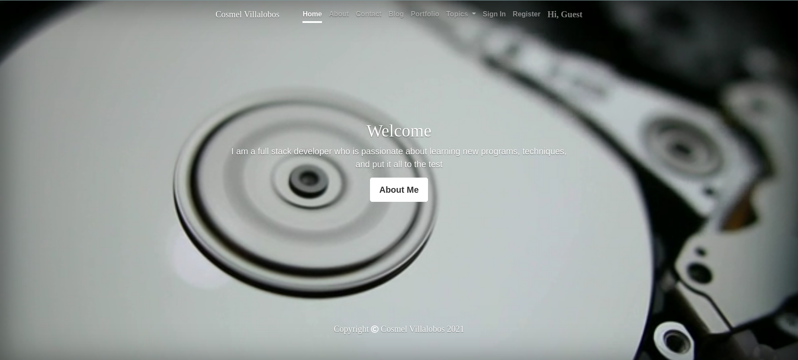

# Portfolio Project

> This is my personal portfolio.

## Built With

- Ruby
- Ruby on Rails
- Bootstrap
- PostgreSQL

## Live Demo

[Live Demo Link](https://livedemo.com)

## Getting Started

To get a local copy up and running follow these simple example steps.

- First thing is to clone the repo by clicking on the green button that says "code" on the top right corner
- and in your command line please run this commands
- ` git clone git@github.com:cvilla714/DevkcPortfolio.git`
- then run `cd DevkcPortfolio /`
- this will get you in the directory where the app is.
- Please follow the setup and install sections to get the app working

### Prerequisites

- Ruby:2.7
- Rails: 6.0.3.4
- PostgreSQL: 12.5

### Install

- Please run `bundle install` to install of the gems that are needed for the app to work

### Setup the database

- Please run ` rails db:create`
- then run `rails db:migrate`
- and finally run `rails db:seed`

### Usage

- In order to start the app , please run in your command line `rails s`. This will start the server
- Next step is to open a window in your webbrowser and type `http://localhost:3000/ ` this will get you to the home page and allow you to use the app

## Authors

👤 **Cosmel Villalobos**

- Github: [@cvilla714](https://github.com/cvilla714)
- Twitter: [@kckeyti](https://twitter.com/kckeyti)
- LinkedIn: [Cosmel Villalobos](https://www.linkedin.com/in/cosvilla/)

## 🤝 Contributing

Contributions, issues, and feature requests are welcome!

Feel free to check the [issues page](https://github.com/cvilla714/DevkcPortfolio/pulls).

## Show your support

Give a ⭐️ if you like this project!

## Acknowledgments

- Jordan Hudgens.

## 📝 License

This project is [MIT](lic.url) licensed.
